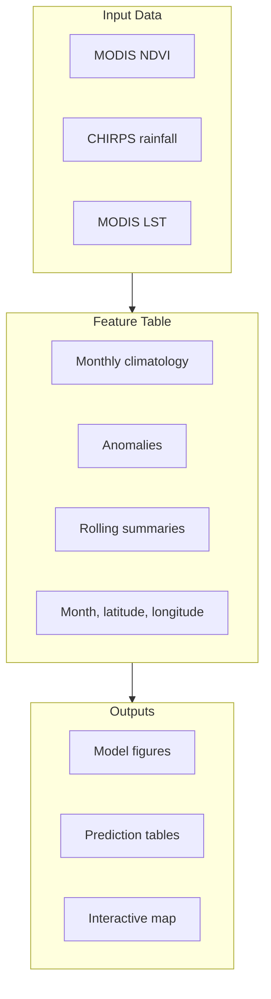

# Project Review

## MENA Drought Risk Mapping

This project turns monthly satellite and climate observations into a drought-risk map for the MENA region. The work begins with raw Earth Engine datasets, reduces them to a regional grid, builds drought-related features, and ends with a baseline model plus map-ready outputs.

The project is deliberately simple in its first version. The grid is broad, the drought label is transparent, and the model is interpretable. That makes the whole workflow easy to inspect before adding more complex geography, labels, or models.

## Figure 1. Project Flow

## Project Steps

| Step | What Was Done | Why It Was Done |
|---|---|---|
| Study area | A broad MENA bounding box was used to frame the analysis. | It gives the project a clear regional scope and keeps the first version reproducible. |
| Grid design | The region was split into regular grid cells. | Satellite pixels need a stable spatial unit before they can become machine-learning rows. |
| Data extraction | MODIS NDVI, CHIRPS rainfall, and MODIS land surface temperature were pulled from Earth Engine. | These variables capture vegetation condition, water supply, and heat stress, which are central to drought risk. |
| Monthly aggregation | Each dataset was summarized by grid cell and month. | A monthly table makes the workflow easier to model, compare, and map. |
| Feature engineering | Climatologies, anomalies, and rolling summaries were created. | Drought is about departure from normal conditions, not only raw values in a single month. |
| Drought labeling | NDVI anomaly thresholds were used to assign drought severity classes. | The label is transparent and tied directly to vegetation stress. |
| Baseline modeling | A Random Forest model was trained using rainfall, temperature, seasonality, and location features. | This tests whether hydroclimate and context variables can explain the drought classes without directly reusing the NDVI label fields. |
| Output export | The notebook exports figures, tables, and an interactive map. | The results become easier to inspect outside the notebook. |

## Figure 2. Data-To-Output Structure

## Data Roles

| Dataset | Role In The Project | Main Contribution |
|---|---|---|
| MODIS NDVI | Vegetation condition | Provides the vegetation-stress signal used to build drought classes. |
| CHIRPS rainfall | Water availability | Adds precipitation context and rainfall anomalies. |
| MODIS land surface temperature | Heat stress | Adds thermal pressure that can intensify drought conditions. |
| Earth Engine | Data access and aggregation | Handles large remote-sensing collections and grid-level reduction. |

## Modeling Review

The label comes from NDVI anomaly, so the model avoids NDVI and NDVI-derived fields as predictors. This is an important design choice. It keeps the model from simply relearning the rule that created the label.

The Random Forest baseline uses rainfall, rainfall anomaly, rolling rainfall, land surface temperature, rolling temperature, month, latitude, and longitude. The model is not treated as an operational drought system. It is a baseline that shows how the mapped classes relate to hydroclimate and spatial context.

| Model Element | Choice | Reason |
|---|---|---|
| Target | NDVI-anomaly drought class | Transparent vegetation-stress proxy. |
| Model | Random Forest | Handles tabular nonlinear patterns and gives feature importance. |
| Excluded predictors | NDVI and NDVI-anomaly fields | Avoids direct label leakage. |
| Evaluation output | Classification report and confusion matrix | Shows class-level behavior, not only a single score. |

## Output Review

| Output | File Area | Purpose |
|---|---|---|
| Confusion matrix | `outputs/figures/` | Shows which drought classes are easier or harder to separate. |
| Feature importance | `outputs/figures/` | Shows which predictors carry the most model signal. |
| Annual drought share | `outputs/figures/` | Summarizes drought-class patterns by year. |
| Latest predictions table | `outputs/tables/` | Gives a compact CSV output for the latest mapped month. |
| Interactive map | `outputs/maps/` | Turns model output into a spatial product that can be inspected visually. |

## Current Reading Of The Project

The strongest part of the project is the full path from observed satellite data to mapped drought-risk output. It does not stop at a model score; it produces a table, figures, and an interactive map.

The main limitation is the label. NDVI anomaly is a useful vegetation-stress proxy, but it is not the same as an independent drought-event record. The grid is also broad, so the map is better read as a regional analytical prototype than a policy boundary product.

The project is now structured around one main notebook, a short reusable Python core, a methodology note, and tests for the feature and modeling helpers. That gives the first project a cleaner base before the second project extends the idea into forecasting.
